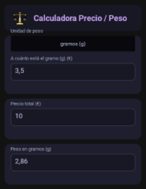
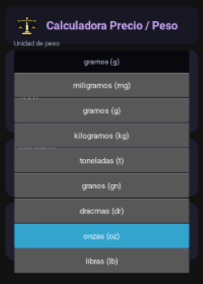
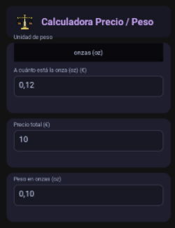
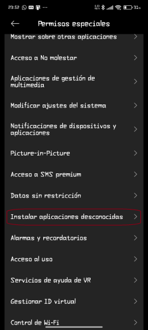
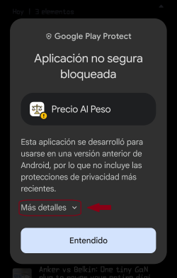
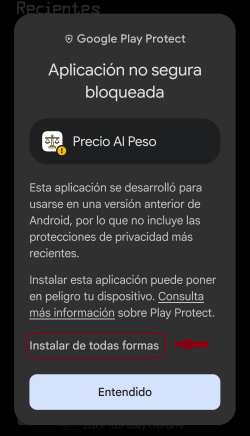

<div align="center">

# PrecioAlPeso


[](https://www.python.org/)
[](https://kivy.org/)
[](https://www.android.com/)
[](LICENSE)

[🇪🇸 Español](README.es.md) | **🇬🇧 English**

**An Android app that helps you compare products by calculating their equivalent price based on their weight.**

</div>

---

# 📱 Screenshots

<table>
  <tr>
    <td valign="top">
      
    </td>
    <td valign="top">
      
    </td>
    <td valign="top">
      
    </td>
  </tr>
</table>

---

# Features

- Instantly calculates the equivalent price of a product based on its weight.
- Enter two values and the third is calculated automatically.
- Built for Android.

---

# Technologies

- Python 3
- Kivy
- Buildozer

---

# 📥 Installation

## Option 1 (Recommended) — Install the APK

### Download the latest release

Download the [**latest APK**](https://github.com/rottencio/PrecioAlPeso/releases/latest)

Or download previous versions from the [**Releases**](https://github.com/rottencio/PrecioAlPeso/releases) section of this repository.

### Transfer the APK to your Android device

You can use:

- USB cable
- Google Drive
- Telegram
- Bluetooth
- Any other file transfer method

### Install the application

Because the application is not distributed through Google Play, Android may display a warning indicating that it comes from an unknown source.

Allow installation from the application you used to open the APK (Files, Chrome, Drive, etc.), then continue with the installation.

<table>
  <tr>
    <td valign="top">
      
    </td>
    <td valign="middle">
      
    </td>
    <td valign="middle">
      
    </td>
  </tr>
</table>

---

## Option 2 — Run from source code

### Clone the repository
>Bash
```bash
git clone https://github.com/rottencio/PrecioAlPeso.git
cd PrecioAlPeso
```

### Create a virtual environment

Linux / macOS / WSL
>Bash
```bash
python3 -m venv .venv
source .venv/bin/activate
```

Windows (PowerShell)
>PowerShell
```powershell
python -m venv .venv
.venv\Scripts\Activate.ps1
```

### Install the dependencies
>Bash
```bash
pip install kivy cython
```

### Launch the application
>Bash
```bash
python main.py
```

---

# Building for Android 

The Android package must be built from Linux or WSL.

## Install the required system dependencies
>Bash
```Bash
sudo apt update

sudo apt install -y \
    git \
    zip \
    unzip \
    openjdk-17-jdk \
    python3-pip \
    python3-venv \
    build-essential \
    autoconf \
    automake \
    libtool \
    cmake \
    pkg-config \
    libffi-dev \
    libssl-dev \
    zlib1g-dev \
    pipx
```

## Install Buildozer
>Bash
```bash
pipx install buildozer
```

## Build the APK
>Bash
```bash
buildozer android debug
```

The generated APK will be available in:

```text
bin/
```

---

# 📄 License

This project is licensed under the ***GNU General Public License v3.0 (GPL-3.0)***. <br>
Copyright information is available in [COPYRIGHT](COPYRIGHT).

---

# 👤 Author

[**rottencio**](https://github.com/rottencio)

# 🙏 Credits

For third-party resources and acknowledgements, see [CREDITS.md](CREDITS.md).